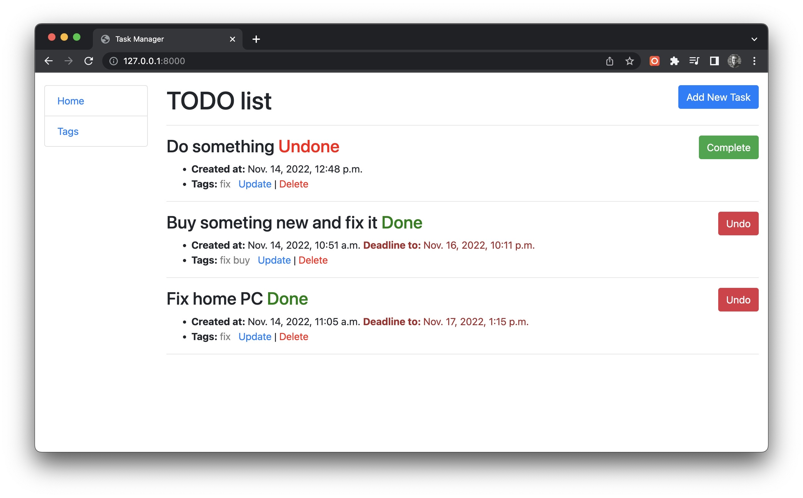
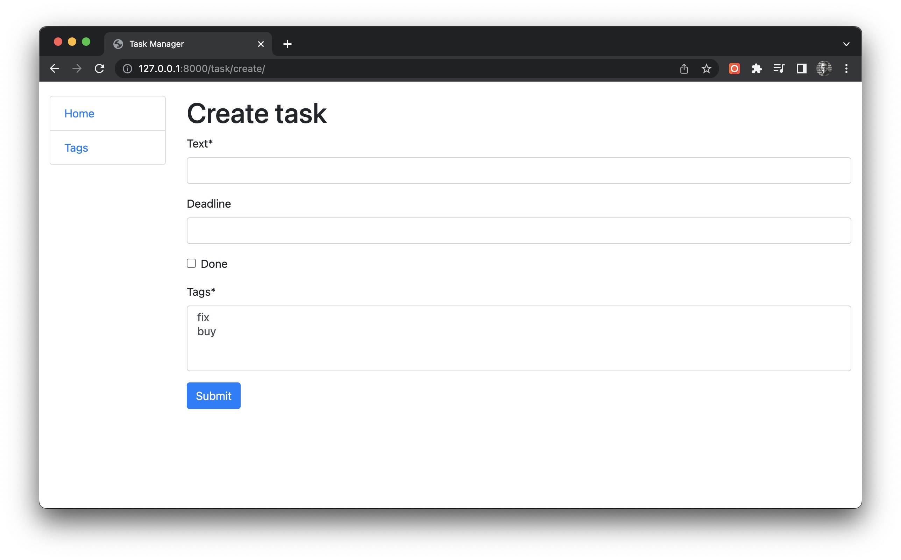

# Django Task Manager

### Task manager on Django

* Implemented task and tags models. Able to assign several tags to tasks
* Ability to create, edit, and delete tasks and tags
* Tasks are sorted by creation date and uncompleted tasks are displayed first
* Marking task Done/Undone implemented

# Installation

### [Python 3](https://www.python.org/downloads/) must be already installed

```shell
git clone https://github.com/VadymShkarbul/django-task-manager.git
cd django-task-manager
python3 -m venv venv
source venv/bin/activate
pip install -r requerements.txt
python manage.py migrate
python manage.py runserver
```




